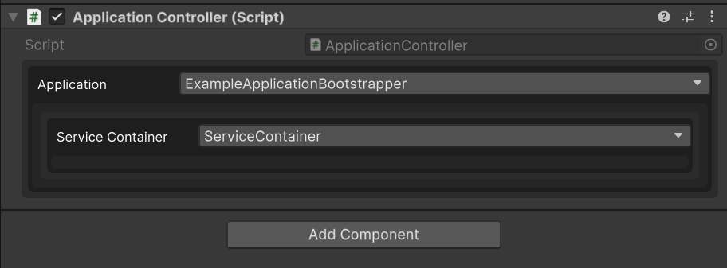
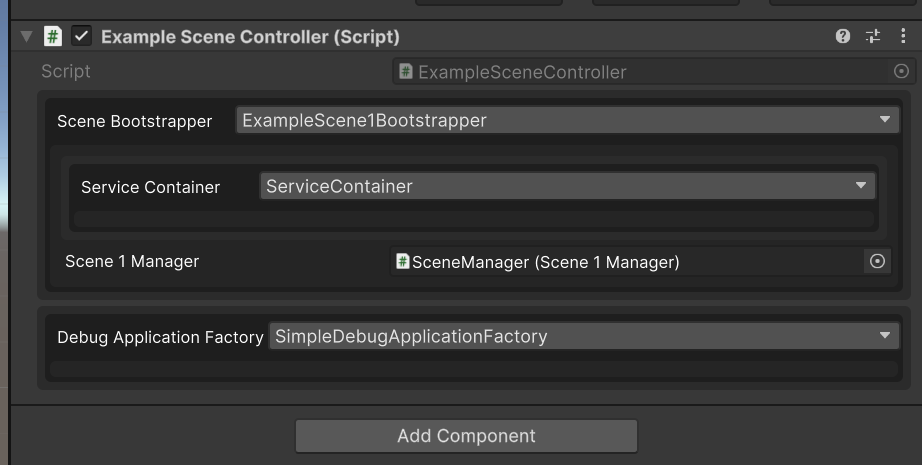

# Readme

## Overview

This is a lightweight dependency injection framework that provides Bootstrapping functionality to handle dependency injection.
It solves the problem of Unity lifecycle breaking flow due to which providing and managing dependencies for a testable application becoming very difficult.


## Installation

1. In Unity, navigate to `Window > Package Manager`.
2. Click the `+` button in the top-left corner, select `Add package from git URL...`, and enter `git@github.com:mage666/unity-application-di-framework.git`.

Using `manifest.json`
Add the following to your manifest
```
"com.stnc.serializeinterface": "git@github.com:mage666/unity-serialize-interface-package.git",
"com.stnc.unity-application-framework": "git@github.com:mage666/unity-application-di-framework.git",
"nuget.moq": "2.0.0"
```

## Documentation

Refer [Documentation](Documentation/Readme.md).

## Usage

### Creating ApplicationBootstrapper

Create your own Bootstrapper by implementing Abstract Class `ApplicationBootstrapper`
```csharp
    public class ExampleApplicationBootstrapper : ApplicationBootstrapper
    {
        public ExampleApplicationBootstrapper(IServiceContainer serviceContainer) : base(serviceContainer)
        {
        }

        public override void Initialize()
        {
            _serviceContainer.Register<ILoggerService>(_ => new LoggerService());
            _serviceContainer.Register<ISceneManager>(_ => new SceneManager());
        }

        public override void Run()
        {
            var logger = _serviceContainer.Resolve<ILoggerService>();
            logger.Log("Bootstrapper initialized");
            
            var sceneManager = _serviceContainer.Resolve<ISceneManager>();
            sceneManager.LoadScene("ExampleScene1");
        }
    }
```
You can load this in Unity in your initial scene using `ApplicationController`


---

### Creating SceneBootstrapper
Create your own Scene Bootstrapper by implementing Abstract Class `SceneBootstrapper`
```csharp
    [Serializable]
    public class ExampleScene1Bootstrapper : SceneBootstrapper
    {
        [SerializeField] private Scene1Manager _scene1Manager;
        public ExampleScene1Bootstrapper(IServiceContainer serviceContainer) : base(serviceContainer)
        {
            
        }
        
        public override void Initialize(IApplicationBootstrapper application)
        {
            base.Initialize(application);
            _serviceContainer.RegisterInstance<IUIManager>(_scene1Manager);
            _serviceContainer.Register<IOperationManager>(_ => new Scene1OperationManager(this));
        }

        public override void Run()
        {
            _serviceContainer.Resolve<IUIManager>().IsInitialized = true;

            _serviceContainer.Resolve<IOperationManager>()
                             .Run();
            var loggerService = Application.ServiceContainer.Resolve<ILoggerService>();
            loggerService.Log("ExampleScene1Loaded");
        }
    }
```

You can load this in scene using `SceneController`


---

### Using ServiceContainer to register dependencies
Using Lambda Factory
```csharp
_serviceContainer.Register<ILogger>(container => new Logger());
```

Using class Factory
```csharp
_serviceContainer.Register<ILogger, LoggerFactory>();
```

Using object instance
```csharp
ILogger logger = new Logger();
_serviceContainer.RegisterInstance(logger);
```

### Using ServiceContainer to resolve dependencies
```csharp
var logger = _serviceContainer.Resolve<ILogger>();
```

---

Refer [Documentation](Documentation/ServiceContainerUsage.md), for more details and how to handle global vs scene services.


## Upcoming Features
- Scene Template to create classes and scene with predefined Bootstrapper and Controller.
- Application Template to create classes and scene with predefined Bootstrapper and Controller.

## Version History
See [CHANGELOG.md](CHANGELOG.md) for details.

## Dependencies
- Unity 6
- `https://github.com/mage666/unity-serialize-interface-package` package.
- Mock Framework `"nuget.moq": "2.0.0"`

## Contributions
Contributions are welcome! Please open an issue or pull request if you have suggestions or bug reports.

## License
This is free and unencumbered software released into the public domain. For more information, please refer to the [LICENSE](LICENSE.md) file or visit [unlicense.org](http://unlicense.org).
